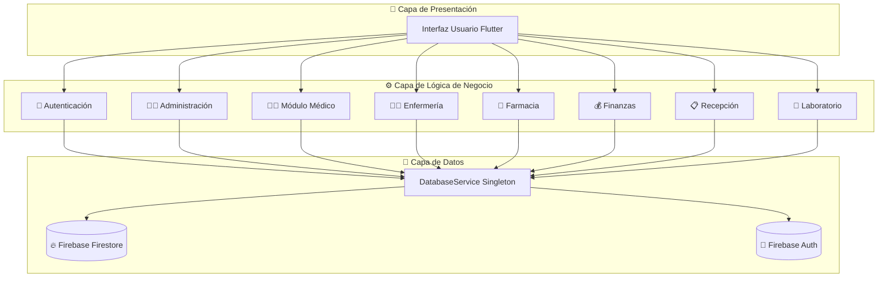
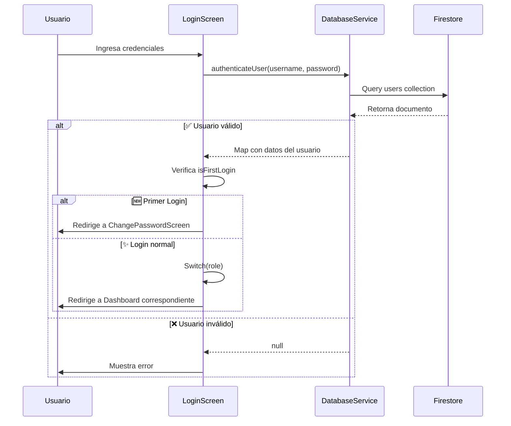
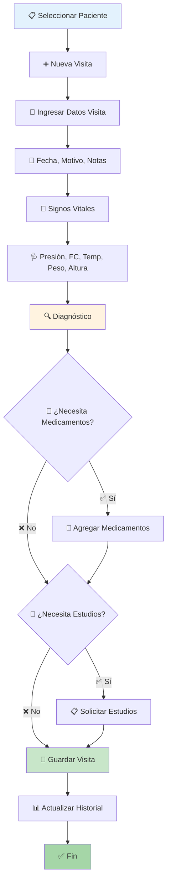
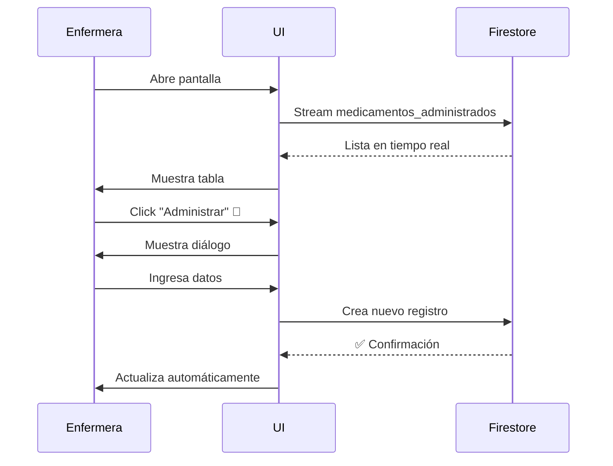
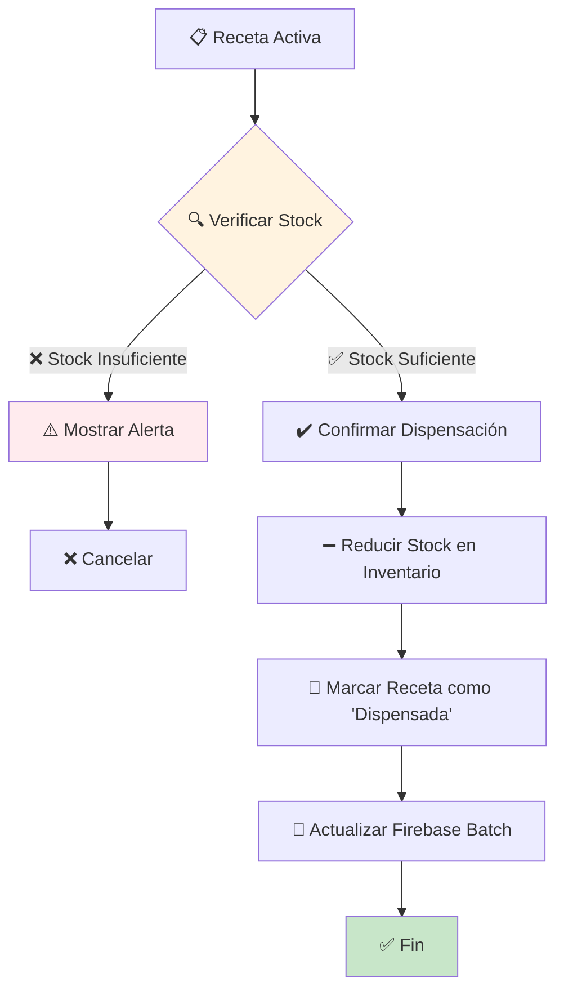
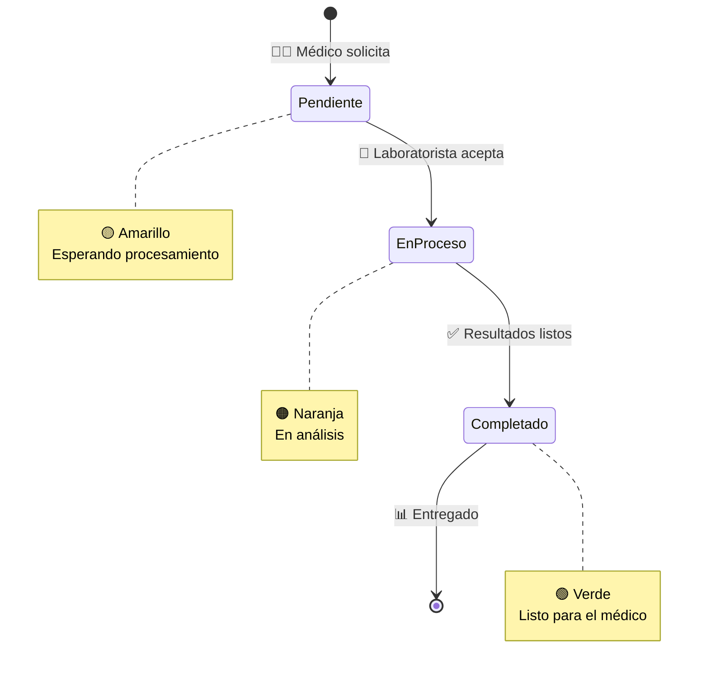

# 🏥 Documentación Técnica Completa - Sistema Hospitalario

---

## 📑 Tabla de Contenidos
1. [🎯 Visión General del Sistema](#-visión-general-del-sistema)
2. [🏗️ Arquitectura del Sistema](#️-arquitectura-del-sistema)
3. [📦 Módulos Detallados](#-módulos-detallados)
4. [💾 Base de Datos (Firestore)](#-base-de-datos-firestore)
5. [🔧 Servicios y Utilidades](#-servicios-y-utilidades)
6. [📘 Guía Técnica de Implementación](#-guía-técnica-de-implementación)

---

## 🎯 Visión General del Sistema

### 📋 Descripción
Sistema de gestión hospitalaria integral desarrollado en **Flutter** que permite la administración completa de múltiples roles de usuario, gestión de pacientes, citas médicas, inventarios farmacéuticos, finanzas y laboratorio clínico.

> [!NOTE]
> Este sistema está diseñado para funcionar tanto en entornos web como de escritorio, proporcionando una experiencia fluida y responsiva.

### 🛠️ Tecnologías

| Categoría | Tecnología | Versión/Detalles |
|-----------|-----------|------------------|
| 🎨 **Frontend** | Flutter | 3.x (Dart) |
| ☁️ **Backend** | Firebase | Firestore + Authentication |
| 📊 **Estado** | Flutter State Management | `setState`, `StreamBuilder`, `FutureBuilder` |
| 🧭 **Navegación** | Flutter Navigation | Rutas nombradas + `MaterialPageRoute` |
| 🎭 **UI/UX** | Material Design | Google Fonts (Archivo, Archivo Narrow) |

### 🌐 Plataformas Soportadas

```
✅ Web (Producción)
✅ Windows Desktop
✅ Android/iOS (Con ajustes menores)
```

---

## 🏗️ Arquitectura del Sistema

### 📐 Diagrama de Arquitectura General



### 📂 Estructura de Directorios

> [!TIP]
> La organización modular facilita el mantenimiento y escalabilidad del proyecto.

<details>
<summary>📁 Haz click para ver la estructura completa</summary>

```
lib/
├── 🚀 main.dart                    # Punto de entrada de la aplicación
├── 🧩 widgets/                     # Widgets compartidos entre módulos
│   └── welcome_message_widget.dart
└── 📱 screens/                     # Módulos principales de la aplicación
    ├── 🔐 login/                   # Sistema de Autenticación
    │   ├── login_screens.dart
    │   ├── change_password_screen.dart
    │   ├── forgot_password_dialog.dart
    │   └── services/
    │       ├── database_service.dart      # ⭐ Servicio central
    │       ├── email_service.dart
    │       └── firestore_diagnostic.dart
    ├── 👨‍💼 admin/                   # Panel de Administración
    │   ├── admin_layout.dart
    │   ├── side_menu.dart
    │   ├── screens/
    │   │   ├── inicio_screen.dart
    │   │   ├── personal_screen.dart
    │   │   ├── finanzas_screen.dart
    │   │   ├── infraestructura_screen.dart
    │   │   ├── reportes_screen.dart
    │   │   └── configuracion_screen.dart
    │   └── widgets/
    ├── 👨‍⚕️ medico/medico/          # Módulo Médico
    ├── 👩‍⚕️ enfermeria/             # Módulo de Enfermería
    ├── 💊 farmacia/                # Módulo de Farmacia
    ├── 💰 finanzas/                # Módulo Financiero
    ├── 📋 recepcionista/           # Módulo de Recepción
    └── 🔬 laboratorio/             # Módulo de Laboratorio
```
</details>

---

## 📦 Módulos Detallados

### 🔐 1. Módulo de Autenticación

#### 📄 Archivos Principales

| Archivo | Función | Icono |
|---------|---------|-------|
| `login_screens.dart` | Pantalla principal de login | 🔑 |
| `change_password_screen.dart` | Cambio de contraseña obligatorio | 🔒 |
| `forgot_password_dialog.dart` | Recuperación de contraseña | 🔓 |

#### 🔄 Flujo de Autenticación



#### 🔑 Funciones Clave

**`authenticateUser()`**
```dart
/// Autentica un usuario contra la base de datos
/// Retorna datos del usuario si las credenciales son válidas
Future<Map<String, dynamic>?> authenticateUser(
  String username,
  String password
) async {
  // 🔍 Busca en colección 'users'
  // ✔️ Valida username + password
  // 📤 Retorna: {username, name, role, isFirstLogin}
}
```

> [!IMPORTANT]
> El sistema verifica si es el primer login del usuario para forzar el cambio de contraseña por seguridad.

#### 🔓 Flujo de Recuperación de Contraseña

```
1️⃣ Usuario ingresa email
2️⃣ Sistema genera código de 6 dígitos
3️⃣ Envía código por email (EmailService)
4️⃣ Usuario ingresa código + nueva contraseña
5️⃣ Sistema valida y actualiza
```

---

### 👨‍💼 2. Módulo de Administración

#### 🖥️ Pantallas

| Pantalla | Función | Métricas |
|----------|---------|----------|
| `inicio_screen.dart` | 📊 Dashboard general | Pacientes, Citas, Personal, Alertas |
| `personal_screen.dart` | 👥 Gestión de empleados | CRUD completo |
| `finanzas_screen.dart` | 💵 Resumen financiero | Ingresos, Egresos, Balance |
| `infraestructura_screen.dart` | 🏢 Gestión de áreas/salas | Capacidad, Estado |
| `reportes_screen.dart` | 📈 Generación de reportes | PDF, Excel |
| `configuracion_screen.dart` | ⚙️ Configuración del sistema | Parámetros globales |

#### 🎯 Dashboard Administrativo

**Métricas Principales:**

````carousel
```
📊 PACIENTES REGISTRADOS
━━━━━━━━━━━━━━━━━━━━━
Total: 1,234
Cambio: +12% ↗️
```
<!-- slide -->
```
📅 CITAS HOY
━━━━━━━━━━━━━━━━━━━━━
Total: 45
Programadas: +45 📈
```
<!-- slide -->
```
👥 PERSONAL ACTIVO
━━━━━━━━━━━━━━━━━━━━━
Total: 120
Médicos: 30
```
<!-- slide -->
```
⚠️ ALERTAS URGENTES
━━━━━━━━━━━━━━━━━━━━━
Pendientes: 5
Prioridad: Alta 🔴
```
````

---

### 👨‍⚕️ 3. Módulo Médico

#### 🏥 Pantallas del Sistema Médico

| Pantalla | Descripción | Acceso Rápido |
|----------|-------------|---------------|
| `dashboard_medico.dart` | Vista general del médico | 🏠 |
| `pacientes_medico.dart` | Lista de pacientes | 👥 |
| `expedientes_medico.dart` | Historial clínico completo | 📋 |
| `nueva_visita_medico.dart` | Registro de consulta | ➕ |
| `recetas_medico.dart` | Gestión de prescripciones | 💊 |
| `estudios_medico.dart` | Solicitud de análisis | 🔬 |
| `resultados_medico.dart` | Visualización de resultados | 📊 |

#### 🩺 Flujo Completo de Consulta Médica



#### 💊 Estados de Recetas

> [!NOTE]
> Las recetas pasan por diferentes estados según su ciclo de vida.

| Estado | Descripción | Color | Acciones |
|--------|-------------|-------|----------|
| `borrador` | 📝 En edición | 🟡 Amarillo | Editar, Completar, Eliminar |
| `activa` | ✅ Lista para dispensar | 🟢 Verde | Dispensar (Farmacia) |
| `dispensada` | 📦 Entregada | 🔵 Azul | Solo lectura |

---

### 👩‍⚕️ 4. Módulo de Enfermería

#### 🏥 Dashboard de Enfermería

**Componentes Visuales:**

```
┌─────────────────────────────────────────┐
│  📊 PACIENTES ASIGNADOS                 │
│  Total: 15                              │
│  🔴 Críticos: 3  🟢 Estables: 12       │
└─────────────────────────────────────────┘

┌─────────────────────────────────────────┐
│  ⚠️ ALERTAS Y NOTIFICACIONES            │
│  • Última tarea pendiente               │
│  • Administrar medicamento a Juan...    │
└─────────────────────────────────────────┘

┌─────────────────────────────────────────┐
│  ✅ TAREAS PENDIENTES                   │
│  ☐ Tomar signos vitales - María        │
│  ☐ Administrar insulina - Pedro        │
│  ☑ Cambio de vendaje - Ana (completada)│
└─────────────────────────────────────────┘
```

#### 💉 Administración de Medicamentos



---

### 💊 5. Módulo de Farmacia

#### 🏪 Pantallas

| Pantalla | Función | Icono |
|----------|---------|-------|
| `dashboard.dart` | Resumen general | 📊 |
| `inventario.dart` | Control de stock | 📦 |
| `recetas_farmacia.dart` | Dispensación | 💊 |
| `solicitudes.dart` | Pedidos de reabastecimiento | 📋 |

#### 🔄 Flujo de Dispensación de Recetas



> [!WARNING]
> El sistema valida automáticamente el stock disponible antes de permitir la dispensación. Si no hay suficiente inventario, se muestra una alerta detallada.

---

### 💰 6. Módulo de Finanzas

#### 💵 Pantallas Financieras

| Pantalla | Función | Vista |
|----------|---------|-------|
| `finance_dashboard_screen.dart` | 📊 Dashboard principal | Métricas del día |
| `income_screen.dart` | 💹 Gestión de ingresos | CRUD + Filtros |
| `expenses_screen.dart` | 💸 Gestión de egresos | CRUD + Categorías |
| `balances_screen.dart` | ⚖️ Saldos y balances | Reportes consolidados |
| `providers_screen.dart` | 🏢 Proveedores | Gestión de contactos |
| `reports_screen.dart` | 📈 Reportes | PDF, Excel, Gráficos |

#### 📊 Dashboard Financiero

**Métricas en Tiempo Real:**

```
╔══════════════════════════════════════════╗
║  💰 INGRESOS DEL DÍA                     ║
║  $15,000                                 ║
║  📈 +8.5% vs ayer                        ║
╚══════════════════════════════════════════╝

╔══════════════════════════════════════════╗
║  💸 GASTOS DEL DÍA                       ║
║  $8,500                                  ║
║  📉 -2.3% vs ayer                        ║
╚══════════════════════════════════════════╝

╔══════════════════════════════════════════╗
║  💵 FLUJO DE CAJA                        ║
║  $6,500                                  ║
║  ✅ Positivo                             ║
╚══════════════════════════════════════════╝
```

---

### 📋 7. Módulo de Recepción

#### 🎯 Proceso de Agendamiento de Citas (3 Pasos)

````carousel
```
┏━━━━━━━━━━━━━━━━━━━━━━━━━┓
┃  PASO 1: DATOS PACIENTE  ┃
┗━━━━━━━━━━━━━━━━━━━━━━━━━┛

📞 Teléfono: __________
   ↓ (Auto-busca paciente existente)
📝 Nombre: __________
📧 Email: __________
🆔 CURP: __________
```
<!-- slide -->
```
┏━━━━━━━━━━━━━━━━━━━━━━━━━┓
┃  PASO 2: SELECCIÓN CITA  ┃
┗━━━━━━━━━━━━━━━━━━━━━━━━━┛

🏥 Área: [Cardiología ▼]
   ↓
👨‍⚕️ Doctor: [Dr. García ▼]
   ↓
📅 Fecha: [15/12/2025]
   ↓
⏰ Hora: [10:00 AM ▼]
```
<!-- slide -->
```
┏━━━━━━━━━━━━━━━━━━━━━━━━━┓
┃  PASO 3: CONFIRMACIÓN    ┃
┗━━━━━━━━━━━━━━━━━━━━━━━━━┛

✅ ¡Cita Confirmada!

📋 Resumen:
• Paciente: Juan Pérez
• Doctor: Dr. García
• Fecha: 15/12/2025
• Hora: 10:00 AM
```
````

---

### 🔬 8. Módulo de Laboratorio

#### 🔄 Estados de Estudios Clínicos



---

## 💾 Base de Datos (Firestore)

### 📊 Colecciones Principales

> [!IMPORTANT]
> Todas las colecciones utilizan la estructura NoSQL de Firestore para máxima flexibilidad.

| Colección | 📝 Documentos | 🔑 Campos Principales |
|-----------|---------------|---------------------|
| `users` | 👥 Usuarios del sistema | `username`, `password`, `name`, `role`, `isFirstLogin` |
| `pacientes` | 🏥 Pacientes | `nombreCompleto`, `curp`, `nss`, `fechaNacimiento`, `estado` |
| `citas` | 📅 Citas médicas | `pacienteId`, `medicoId`, `fecha`, `hora`, `estado` |
| `visitas` | 🩺 Consultas | `pacienteId`, `signos_vitales`, `diagnostico`, `medicamentos[]` |
| `recetas` | 💊 Recetas | `pacienteNombre`, `medicamentos[]`, `estado` |
| `medicamentos_inventario` | 📦 Stock | `nombre`, `stock`, `precio`, `categoria` |
| `estudios` | 🔬 Solicitudes lab | `tipoEstudio`, `estado`, `prioridad`, `resultados` |
| `tareas_enfermeria` | ✅ Tareas | `descripcion`, `estado`, `fechaProgramada` |
| `metricas_financieras` | 💰 Métricas | `dailyIncome`, `dailyExpenses`, `cashFlow` |

### ⚡ Índices Recomendados

> [!TIP]
> Estos índices compuestos optimizan las consultas más frecuentes del sistema.

```javascript
// 📅 Citas médicas
citas: (medicoId ↑, fechaHora ↑)

// 🔬 Estudios
estudios: (estado ↑, fechaSolicitud ↓)

// 💊 Recetas
recetas: (estado ↑, creadoEn ↓)

// ✅ Tareas
tareas_enfermeria: (estado ↑, fechaProgramada ↑)
```

---

## 🔧 Servicios y Utilidades

### ⚙️ DatabaseService (Singleton)

> [!NOTE]
> Este es el **servicio central** que maneja toda la comunicación con Firebase.

**📍 Ubicación:** `lib/screens/login/services/database_service.dart`

#### 🎯 Métodos Principales

| Método | Descripción | Retorno |
|--------|-------------|---------|
| `authenticateUser()` | 🔐 Valida credenciales | `Map<String, dynamic>?` |
| `createUser()` | ➕ Crea nuevo usuario | `bool` |
| `updatePassword()` | 🔒 Actualiza contraseña | `bool` |
| `sendVerificationCode()` | 📧 Envía código por email | `bool` |
| `getPatientCount()` | 📊 Total de pacientes | `int` |
| `addVisit()` | 🩺 Guarda consulta | `bool` |
| `getFinancialMetrics()` | 💰 Métricas financieras | `Map` |
| `seedDemoData()` | 🌱 Puebla BD con datos demo | `void` |

---

## 📘 Guía Técnica de Implementación

### 🎨 Patrones de Diseño

#### 🔹 Singleton
```dart
/// DatabaseService - Única instancia compartida
class DatabaseService {
  static final DatabaseService _instance = DatabaseService._internal();
  factory DatabaseService() => _instance;
  // ...
}
```

#### 🔹 Observer (Tiempo Real)
```dart
/// Actualización automática desde Firestore
StreamBuilder<QuerySnapshot>(
  stream: FirebaseFirestore.instance
    .collection('recetas')
    .snapshots(),
  builder: (context, snapshot) { /* UI */ }
)
```

### 📱 Responsive Design

> [!TIP]
> El sistema adapta su interfaz automáticamente según el tamaño de pantalla.

```dart
LayoutBuilder(
  builder: (context, constraints) {
    final isSmall = constraints.maxWidth < 600;
    return isSmall ? 
      MobileLayout() :  // 📱 Mobile
      DesktopLayout();  // 🖥️ Desktop
  }
)
```

### 🔒 Consideraciones de Seguridad

> [!CAUTION]
> **IMPORTANTE PARA PRODUCCIÓN:**
> - ⚠️ Las contraseñas están en texto plano (usar bcrypt/argon2 en producción)
> - ⚠️ Implementar Firebase Security Rules
> - ⚠️ Validar permisos por rol en backend
> - ⚠️ Activar HTTPS obligatorio

### 🚀 Optimizaciones Recomendadas

```
✅ Paginar consultas grandes (usar limit + offset)
✅ Implementar caché local (Hive, SharedPreferences)
✅ Lazy loading de imágenes/datos pesados
✅ Comprimir assets e imágenes
✅ Minificar código en producción
```

---

## 📞 Soporte y Mantenimiento

> [!NOTE]
> Para añadir nuevos módulos o funcionalidades, sigue la estructura modular existente.

### 📝 Checklist para Nuevo Módulo

- [ ] Crear carpeta en `lib/screens/nuevo_modulo/`
- [ ] Crear `dashboard_nuevo.dart`
- [ ] Registrar ruta en `main.dart`
- [ ] Agregar caso en switch de `LoginScreen`
- [ ] Actualizar `DatabaseService` si es necesario
- [ ] Documentar en este archivo

---

<div align="center">

**🏥 Sistema Hospitalario v1.0**

Desarrollado con ❤️ usando Flutter & Firebase

---

📅 Última actualización: Diciembre 2025

</div>
